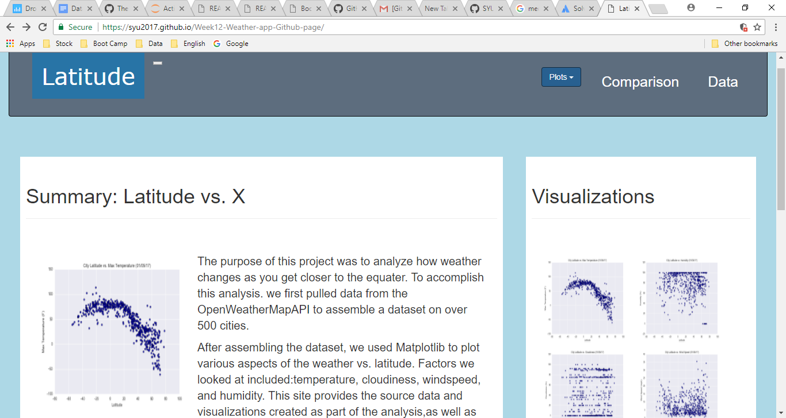

# Week12-Weather-app-Github-page---https://syu2017.github.io/Week12-Weather-app-Github-page/

1.  Deploy the week12 weather dashboard website to github pages, with the website working on a live, publicly accessible URL as a result.

        GitHub Pages is designed to host your personal, organization, or project pages from a GitHub repository.

         Your site is published at https://syu2017.github.io/Week12-Weather-app-Github-page/
         
         

2.  Deploy Guide

     1. Create a new repository on your GitHub account. You can name this repository whatever you would like.
   
     2. Once inside of the repository, create a new file and name it index.html
   
     3. Add your HTML into this file, save it, and then navigate into your repository's Settings tab.
     
     4. Scroll down to the GitHub Pages section and then, in the section labeled Source, select that you would like to use the master branch as your source.

     5. Navigate to _username_.github.io/_repositoryname_ and you will find that your new web page has gone live!

